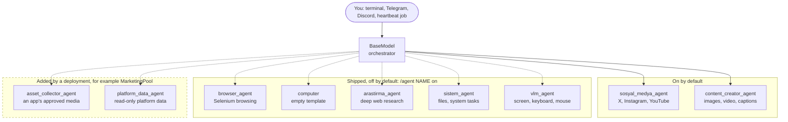

<p align="center">
  
</p>

# Ethgent

**A customisable LLM agent: an orchestrator, sub-agents and tools that you shape to a domain.**

Ethgent is a standalone, operable product, not a framework you assemble: clone it, run `./run.sh`, and you have an orchestrator LLM (`BaseModel`) that delegates to specialised sub-agents, a terminal to manage it, and its own logs, run history and cost tracking. What the agent *is for* is decided by its configuration: which sub-agents exist, which tools they own, and what their prompts say. Agents and tools live in YAML and in packs, and can be created, edited, pulled from another repository and shared from the terminal without touching code.

It ships tuned for **social media and content** (X, Instagram, YouTube, image and video content, browser automation, research), but that is a configuration, not its limit. See [Make it your own](#make-it-your-own). (It can also be embedded as a library in another Python process, see [below](#using-ethgent-as-an-embedded-agent), but that is the exception.)

[](https://www.python.org/)
[](LICENSE)

---

## Table of Contents

- [Features](#features)
- [Make it your own](#make-it-your-own)
- [Architecture](#architecture)
- [The agents](#the-agents)
- [Quick Start](#quick-start)
- [Configuration](#configuration)
- [Terminal Commands](#terminal-commands)
- [Operations: logs, run history, usage](#operations-logs-run-history-usage)
- [Telegram and Discord](#telegram-and-discord)
- [Using Ethgent as an Embedded Agent](#using-ethgent-as-an-embedded-agent)
- [Project Structure](#project-structure)
- [Requirements](#requirements)
- [Testing](#testing)
- [Contributing](#contributing)
- [License](#license)

## Features

- **Content Creator Agent** — text, image, and video content generation (HTML/CSS → PNG posts, stock footage → MP4 reels, website-to-post extraction).
- **Social Media Agent** — X (Twitter), Instagram, and YouTube automation: posting, replies, likes, follows, notification scanning, market snapshots.
- **Browser Agent** — Selenium-based navigation, DOM reading, and form interaction.
- **Research Agent** — multi-query web research and report synthesis (Gemini Live API).
- **System Agent** — file/workspace management and system status monitoring.
- **VLM Agent** — screen capture, mouse/keyboard control with self-verifying vision loop.
- **Agent Studio** — add, enable/disable, and reconfigure agents and tools through YAML config, no code changes required.
- **Agent Packs** — plug-and-play bundles of agents, tools, and prompts.
- **Heartbeat Scheduler** — cron/interval-based background jobs (APScheduler), managed from the terminal.
- **Interactive terminal control interface** — create, edit, copy, test and delete agents and tools, schedule heartbeat jobs, package and share a setup, review logs, approve risky actions, all from one CLI session and without a restart.
- **Operations store** — persistent logs, per-run history (what each scheduled job did, how long it took, what it cost) and LLM token usage, queryable from the terminal.
- **Remote management with access control** — the same management commands over Telegram/Discord for allow-listed admins only, with remote code upload deliberately blocked.

## Make it your own

The shipped agents are social-media ones, but the machinery is general: an agent is a prompt, a model and a set of tools, and a tool is a Python function. To point Ethgent at another domain you write your tools, give an agent those tools and a prompt, try it, and, if you like, package it for others. Everything below happens in the terminal (or in `config/*.yaml`), without touching Ethgent's code. The names are illustrations; none of these tools ship with Ethgent.

**1. Write a tool.** A tool is a plain function in a Python file. Its docstring (or the `--desc` you pass) is how the model decides when to call it, so say what it does and what it returns.

```python
# ~/tools/prices.py
def get_price(symbol: str) -> dict:
    """Return the latest price of a symbol, e.g. get_price("AAPL"). Read-only."""
    ...
    return {"symbol": symbol, "price": 123.4}
```

```
/tool create --file ~/tools/prices.py --all          # every public function becomes a tool
/tool create get_price --file ~/tools/prices.py      # or just one, named after its function
/tool show get_price                                 # check what was registered
```

The code is compiled and imported before it is accepted, so a broken tool is rejected immediately (details in [Custom tools](#custom-tools)). Secrets it needs go in with `--env NAME=value`, which writes to the gitignored `.env.model`.

**2. Give it to an agent.** Create a sub-agent that owns the tool, with its own prompt and, if you want, its own model.

```
/agent create trading_agent --tools get_price,bellek_yaz,bellek_oku \
    --prompt "You analyse positions and write a short journal entry. Never place orders." \
    --desc "Market data and journaling"
```

Change it later with `/agent edit trading_agent --add-tools get_candles --prompt "..." --model <name>`, copy it with `/agent copy`, and look at the result with `/agent show trading_agent`. The same fields live in `config/agents.yaml` (`name`, `description`, `model`, `system_prompt`, `tools`, `enabled`). The orchestrator reaches your tool only through this sub-agent, so giving the agent read-only tools is how you keep it read-only; a tool that changes something outside goes through the approval step. To change how the orchestrator itself behaves, use `/prompt set "..."` (and `/prompt reset` to go back).

**3. Try it.** Run the one agent directly, before involving the orchestrator, and look at the run it recorded:

```
/agent test trading_agent "What is the latest price of AAPL?"
/runs 5
/logs 20 --grep trading_agent
```

When it behaves, ask the same thing in the normal chat and the orchestrator will delegate to it.

**4. Package and share it.** Export the agent with its tools and prompt as a pack, put the folder in a GitHub repository, and anyone can install it:

```
/agent pack export trading_pack --agents trading_agent --out ~/trading_pack   # you
# push ~/trading_pack to github.com/you/trading-pack                          # you

/agent pack install github:you/trading-pack                                   # anyone else
```

The installer shallow-clones the repository, shows a preview of the agents and tools it would add, and asks before installing. The pack carries tool code that runs on your machine, so read the preview and install only packs you trust. The export lists environment variable **names** only, never values. More in [Sharing a setup](#sharing-a-setup).

**Other domains work the same way.** An HR agent would have tools such as `list_applicants` and `read_cv`, and a prompt about screening against a role description; a support agent would have tools over a ticket system. Only the tools and the prompt change.

Ready-made connectors and workers that join Ethgent to an application or to platform APIs live in the separate open pool [Marketing Agent Assets](https://github.com/Ahmet2001/MarketingPool/tree/main/marketing-agent-assets); Ethgent does not require it.

## Architecture

```
main.py
 ├─ background tasks: heartbeat_loop, telegram bot (optional), discord bot (optional)
 └─ TerminalManager (foreground)
       └─ AutomationCoordinator (mutex: only one caller touches BaseModel/browser at a time)
             └─ BaseModel.text_query()
                   └─ tool-calling loop (≤12 turns, repeat-call guard)
                         ├─ base tools (memory, workspace, search, …)
                         └─ SubModel agents (each runs its own inner LLM + tool loop)
```

- **`BaseModel`** (`MarketingApp/llms/BaseModel.py`) is the orchestrator: an OpenAI-compatible chat-completions loop that calls tools and sub-agents until it has a final answer.
- **`SubModel`** agents (`MarketingApp/llms/SubModels/`) are self-contained mini-agents, each with their own model and tool subset, exposed to `BaseModel` as a single callable tool.
- **`AutomationCoordinator`** (`MarketingApp/environments/automation_runtime.py`) is a lock ensuring the terminal, heartbeat, and Telegram/Discord triggers never touch the shared browser session concurrently.
- **`telemetry`** (`MarketingApp/telemetry.py`) is the operations store: a `run` is opened per unit of work (a chat turn, a heartbeat job) and carried in a `ContextVar`, so every log line and LLM call made inside it is attached to it automatically.
- **`Agent Studio`** (`MarketingApp/llms/agent_studio.py`) reads `config/agents.yaml`, `config/custom_tools.yaml`, and `config/agent_packs.yaml` to assemble the runtime — agents and tools can be added, toggled, or reconfigured without touching code.

## The agents

The orchestrator (`BaseModel`) does not call tools directly: it hands a task to a **sub-agent**, and each sub-agent owns its own model and its own set of tools. A tool is reachable only through a sub-agent that lists it, so giving an agent read-only tools is how you keep it read-only. Seven sub-agents ship in `config/agents.yaml`; two are on by default. A deployment can add more (the MarketingPool example adds two, shown dashed), and so can you with `/agent create` or a pack.



| Sub-agent | What it does | Default | Model |
|---|---|---|---|
| `sosyal_medya_agent` | Publishing, engagement and notification scanning on X, Instagram and YouTube, driven through a signed-in browser session | on | `default` (follows `SUBMODEL_MODEL_NAME`) |
| `content_creator_agent` | Captions, stock photo and video search, website-to-post extraction, HTML/CSS to PNG posts, MP4 reels | on | `default` |
| `browser_agent` | Selenium-based navigation, DOM reading and form interaction | off | `browser_default` (follows `BROWSER_AGENT_MODEL`) |
| `computer` | A blank Agent Studio template for computer-related tasks: no tools until you attach some | off | `default` |
| `arastirma_agent` | Multi-query web research and report writing | off | Gemini Live (needs `GEMINI_API_KEY`) |
| `sistem_agent` | File and workspace management, system status, terminal commands | off | Gemini Live |
| `vlm_agent` | Screen capture and mouse/keyboard control with a self-verifying vision loop | off | Gemini Live |

Turn one on with `/agent <name> on`, inspect it with `/agent show <name>`, and write your own with `/agent create` ([Terminal Commands](#terminal-commands)). Tools marked as risky ask for approval in the terminal before they run.

**The two a deployment can add.** `asset_collector_agent` lists, validates and prepares the approved media an application exposes. `platform_data_agent` asks a separate worker for read-only platform data and never holds the platform's credentials. Both live in the MarketingPool copy of this agent, not in this repository; they show that adding a sub-agent is a configuration step, not a change to the orchestrator.

## Quick Start

```bash
git clone https://github.com/Ahmet2001/BrowserAgent.git
cd BrowserAgent
chmod +x run.sh
./run.sh
```

`run.sh`:
1. Creates a `.venv` if one doesn't exist.
2. Installs/updates packages from `requirements.txt`.
3. Launches the interactive terminal via `python -m MarketingApp.main`.

For PNG/video rendering, also install the Playwright browser once:

```bash
source .venv/bin/activate
playwright install chromium
```

## Configuration

Copy `.env.example` to `.env` and fill in your keys. Settings are loaded in this order (later files override earlier ones): `.env` → `.env.local` → `.env.model` → `.env.secrets`.

| File | Purpose |
|---|---|
| `.env` | Base model/provider settings, Telegram token |
| `.env.local` *(optional)* | Local overrides, kept out of version control |
| `.env.model` *(optional)* | Model-specific overrides |
| `.env.secrets` *(optional)* | Additional API keys (Pexels, etc.) |

Key variables:

| Variable | Description |
|---|---|
| `MODEL_PROVIDER` | `gemini` or an OpenAI-compatible provider |
| `OPENAI_COMPAT_BASE_URL` | Base URL for the OpenAI-compatible endpoint |
| `BASE_MODEL_NAME` / `SUBMODEL_MODEL_NAME` / `BROWSER_AGENT_MODEL` | Model IDs per role |
| `GEMINI_API_KEY` / `GEMINI_API_KEY_SECONDARY` | Gemini API keys (with failover) |
| `TELEGRAM_TOKEN` / `DISCORD_TOKEN` | Optional chat platform integrations |
| `PEXELS_API_KEY` | Stock photo/video search for the Content Creator agent |
| `TELEGRAM_ALLOWED_USER_IDS` / `DISCORD_ALLOWED_USER_IDS` | Who may chat with the bot (see [Telegram and Discord](#telegram-and-discord)) |
| `TELEGRAM_ADMIN_IDS` / `DISCORD_ADMIN_IDS` | Who may run management commands remotely |
| `ETHGENT_TELEMETRY_RETENTION_DAYS` | How long logs/runs/usage are kept (default `30`, `0` = forever) |

All API keys and tokens live only in the gitignored `.env*` files (`.env`, `.env.local`, `.env.model`, `.env.secrets`) — never commit real credentials.

## Terminal Commands

Once running, type a message to chat with Ethgent, or use a command. `/help` prints everything below.

| Command | Description |
|---|---|
| `/status` | Model, provider, uptime, channels, config errors, store health and today's token usage |
| `/agents`, `/agent list` | List agents |
| `/agent <name> on\|off\|toggle` | Enable/disable an agent |
| `/agent show <name>` | Type, model, tool list, prompt and any config errors for one agent |
| `/agent create <name> [flags]` | Create an agent (`--model`, `--tools`, `--tool-group`, `--tool-category`, `--prompt`, `--desc`, `--dry-run`) |
| `/agent edit <name> [flags]` | Change one (`--add-tools`, `--remove-tools`, `--remove-tool-group`, `--enable`/`--disable`, …) |
| `/agent copy <from> <to>` | Clone an agent with its resolved tool list |
| `/agent test <name> "task"` | Run a single agent directly and record it as a run |
| `/agent delete <name> [--yes]` | Delete a config agent |
| `/agent pack list\|preview\|install\|export` | Manage agent packs, see [Sharing a setup](#sharing-a-setup) |
| `/tools [query] [--group G] [--category C] [--risk high]` | List and filter tools; `--list-groups` shows the groups, categories and risk split |
| `/tool <name> on\|off\|toggle` | Enable/disable a tool |
| `/tool create\|edit\|show\|delete\|list` | Manage custom tools, see [Custom tools](#custom-tools) |
| `/heartbeat` | Scheduler and job status |
| `/heartbeat add --cron X --gorev "..."` | Add a scheduled task (`startup`, `*/N` or `HH:MM`) |
| `/heartbeat remove <id>`, `show <id>`, `on`, `off` | Remove/inspect a task, enable/disable the scheduler |
| `/heartbeat run\|pause\|resume <id>`, `reload` | Control jobs, reload the config |
| `/heartbeat log [id] [n]` | Past runs of a job: when, how long, what it produced |
| `/logs [n] [--since 24h] [--type T] [--grep text] [--run id]` | Persistent logs (`--memory` = this process only) |
| `/runs [n] [--source S] [--status S] [--since 24h]` | Run history across the terminal, heartbeat, Telegram and Discord |
| `/run <id>` | One run in detail: duration, error, token breakdown by agent/model, its log lines |
| `/usage [--since 24h] [--by agent\|model\|source\|day\|run]` | LLM token usage, plus a cost estimate if `config/pricing.yaml` exists |
| `/errors [text]` | Config problems that were previously collected but never shown |
| `/reload` | Reload agent/custom tool config |
| `/provider` | Show the active provider/model and which agents have a literal (non-default) model pinned in `agents.yaml` |
| `/provider set <name> [--base-model M] [--submodel-model M] [--browser-model M] [--base-url URL] [--api-key K] [--reset-pins] [--dry-run]` | Switch provider/model, writing to `.env.model`; `--reset-pins` un-pins agents back to the `default` sentinel so they follow the new provider |
| `/memory [category] [key]`, `/memory search <text>`, `/memory delete <category> <key> --yes` | Inspect, search and remove entries from the agent's long-term memory (`bellek_yaz`/`bellek_oku`) without going through chat |
| `/history`, `/clear`, `/exit` | Chat history / shut down |

Destructive commands ask for confirmation unless you pass `--yes`. `--dry-run` on `agent create/edit` and `heartbeat add` previews the result without saving.

**Switching providers:** each agent's `model:` field in `agents.yaml` is normally the sentinel `default` (or `browser_default`), which is re-resolved from `SUBMODEL_MODEL_NAME`/`BROWSER_AGENT_MODEL` on every boot. If an agent has ever been given an explicit `--model` (via `/agent create`/`edit`/`copy`), that literal name is pinned and does **not** follow a later `/provider set` — use `--reset-pins` to un-pin it. Also note that model *name* changes take effect immediately via `/reload`, but a provider swap (`--base-url`/`--api-key`) only fully applies after restarting the app, since the underlying HTTP clients are built once at boot.

### Custom tools

```
/tool create fiyat_getir --file ~/fiyat_getir.py --desc "Returns a price"
/tool create --file ~/kripto.py --all            # every public function in the file becomes a tool
/tool create --file ~/kripto.py --names a,b      # only these, sharing one copy of the file
/tool create x --code "def x(): return 1" --desc "inline"
```

The code is compiled, checked for a function named after the tool, and actually imported before it is accepted, so a broken tool is rejected at write time. The file is **copied** into `workspace/custom_tools/`; re-run `/tool edit <name> --file …` to pick up later changes. `--env NAME=value` writes to the gitignored `.env.model`; a bare `--env NAME` only records the requirement.

### Sharing a setup

```
/agent pack export my_pack --agents my_agent --out ~/my_pack   # or --all
/agent pack install ~/my_pack
/agent pack install github:user/repo[@branch][#sub/dir]   # shallow-clones the repo, shows the preview, asks before installing
```

`export` writes `plugin.yaml`, `agents/`, `prompts/`, `tools/`, a README and an `env.example` that contains variable **names only** — never values. Builtin tools cannot be packaged (they already exist in every install). Builtin agents *can* be packaged: one you scaffolded yourself (`/agent create --builtin`) travels with its own `submodels/<name>.py` source and installs even where it doesn't exist yet; one of the seven agents the app ships with (`sosyal_medya_agent`, `content_creator_agent`, …) travels as config only — model/tools/prompt — since the target install already has its code.

## Operations: logs, run history, usage

Everything is stored in `workspace/runtime/telemetry.sqlite` (gitignored) and kept for `ETHGENT_TELEMETRY_RETENTION_DAYS` days.

- **Logs** survive restarts (`/logs`).
- **Runs** record every chat turn and heartbeat job — including skipped ones and retry attempts — with status, duration, error and a summary of the output (`/runs`, `/run`, `/heartbeat log`). The heartbeat's own `job_runtime` table only keeps the *last* run per job; this keeps them all.
- **Usage** records the tokens of every LLM call, attributed to the run, agent, model and channel it happened in (`/usage`).

Cost is estimated only for models you price in `config/pricing.yaml` (USD per 1M tokens); Ethgent ships no prices because they change and model names are install-specific:

```yaml
models:
  gemini-2.5-flash: {input: 0.30, output: 2.50}
```

Known limits: the Gemini Live agents (`arastirma_agent`, `sistem_agent`, `vlm_agent`) produce one **approximate** usage row per session, because the SDK does not document whether Live `usage_metadata` is cumulative; providers that return no usage data are counted as calls with unknown tokens.

## Telegram and Discord

The bots can now run the management commands above, but **who may talk to them is configured by you**:

| Variable | Meaning |
|---|---|
| `<CHANNEL>_ALLOWED_USER_IDS` | Who may chat. **If unset, chat is open to everyone** (the old behaviour) and startup prints a warning. |
| `<CHANNEL>_ADMIN_IDS` | Who may run management commands. If unset they are **disabled**. |

Send `/id` (Telegram) or `!id` (Discord) to the bot to learn your numeric ID. Unauthorised users get no reply; each attempt is written to the log (`/logs --type remote`).

Management commands are `/agent`, `/tool`, `/heartbeat`, `/usage`, … on Telegram and `!agent`, `!tool`, … on Discord. Even for an admin, remote sessions cannot run `/tool create|edit|delete` or `/tool show --code` (tool code runs on the server), `/agent pack …` (filesystem paths) or `/agent create --builtin`, and `agent delete` / `heartbeat remove` require `--yes`.

## Using Ethgent as an Embedded Agent

**This is an advanced, secondary integration path.** Ethgent's primary form is the standalone terminal app described above; nothing here changes that. `MarketingApp/agent_api.py` exists only for the narrow case where another Python orchestrator (e.g. an asset-generation pipeline) needs to call Ethgent's `BaseModel` in-process instead of running it as a separate app — no logs/run-history/telemetry UI, no bots, no terminal, just a single `run()` call:

```python
from MarketingApp.agent_api import EthgentAgent

agent = EthgentAgent(workspace_dir="/path/to/pool/brandX/workspace")
result = await agent.run("Draft a post about today's topic for X")
print(result.text)
```

`EthgentAgent` never starts the heartbeat/Telegram/Discord background tasks. Workspace and config directories can be redirected per instance via `workspace_dir`/`config_dir` (see the module docstring for the single-process-per-workspace caveat).

## Project Structure

```
MarketingApp/
├── agent_api.py         # Embeddable agent wrapper (EthgentAgent)
├── paths.py              # Central, overridable workspace/config path resolution
├── main.py               # Entry point (python -m MarketingApp.main)
├── telemetry.py           # Persistent logs, run history and token usage
├── araclar/               # Tools: browser, search, memory, content creation, workspace, skills
├── config/                # agents.yaml, custom_tools.yaml, agent_packs.yaml, heartbeat_config.yaml
├── environments/          # terminal.py, heartbeat.py, telegram.py, discord_bot.py, automation_runtime.py,
│                          # access.py (bot allowlists), remote_commands.py (terminal commands over chat)
├── llms/                  # BaseModel orchestrator, Agent Studio, SubModels/
├── legacy/panel/          # Archived FastAPI web panel (superseded by the terminal interface)
└── workspace/              # Runtime data: memory, drafts, assets, custom tools, agent packs
tests/                       # unittest suite (isolated temp workspace)
```

## Requirements

- Python 3.11+
- Chrome browser (for X/social automation)
- An active X (Twitter) session in a Chrome profile, for social features

## Testing

```bash
python -m unittest discover -s tests
```

The suite runs against a temporary workspace and config directory (`tests/_env.py`), so it never touches your real agents, tools or telemetry. Use `discover -s tests` rather than `tests.<module>`: a dependency installs a top-level `tests` package that shadows it.

## Contributing

Issues and pull requests are welcome. Please keep changes scoped and include a short description of what changed and why.

## License

MIT © 2026 Ahmet Rıfat Öztürk — see [LICENSE](LICENSE).
